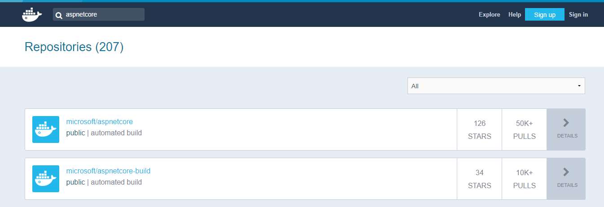

# Docker Tutorial with asp.net core

## The Dockerfile

If you already have basic knowledge of Docker skip this introduction and go straight to "Choose an image".

You can run one of the many images that exist ready for usage on [hub.docker.com](https://hub.docker.com). You can for example
run a command on an instance of Debian a popular Linux Distro with the following command:

```powershell
docker run debian echo "Welcome to the Focusday"
```


This might take a short time the first time, since docker has to pull the image. A second time should start the command in a fraction of a second.

Instead of running a "throw away"-container you can also use an container interactively like so:

```powershell
docker run -it debian /bin/bash
```


Check out the docker run reference to find out more: [docker run](https://docs.docker.com/engine/reference/run/)


But you can not only run other peoples images, you can also create your own images. For that you will need to create a *Dockerfile*. The *Dockerfile* describes an image and all its dependencies in steps.

We can start with a simple Dockerfile that extends our hello world example.

Create a new folder called cowsay and add a file called Dockerfile. Add the following content to the file:

```dockerfile
FROM debian

RUN apt-get update && apt-get install -y cowsay

ENTRYPOINT ["/usr/games/cowsay"]
```

In this dockerfile we are doing the follwing:

1. defining what base image we want to use => debian
2. running a command in the image that updates the packagemanager and installs an app called cowsay
3. defining what app to run when the image is run

For a full reference of the available instructions in Dockerfile go here [Dockerfile](https://docs.docker.com/engine/reference/builder/)

Now lets build the image with the build command from the created folder:

```powershell
docker build -t cowsay .
```


Now that we have build our image we can run it:

```powershell
docker run cowsay "Welcome to the Focusday"
```


## Choose an image

Go to [hub.docker.com](https://hub.docker.com) and search for  aspnetcore
You will find many different choices. If there are no very special reasons i would opt for official images or images uploaded by the involved companies. Two images are interesting:



There are two different images provided by microsoft. One of them only contains the runtime and the other contains the SDK as well - see the following descriptions

### ASP.NET Core Docker Image
This repository contains images for running **published** ASP.NET Core applications. These images use the
microsoft/dotnet image as its base.

### ASP.NET Core Build Docker Image
This repository contains images that are used to **compile/publish** ASP.NET Core applications inside the container. This is different to compiling an ASP.NET Core application and then adding the compiled output to an image, which is what you would do when using the microsoft/aspnetcore image. These Dockerfiles use the microsoft/dotnet image as its base.

## Create a asp.net core project

create a folder called docker-tutorial and navigate to it, then execute the following command:

```powershell
dotnet new webapi
```

## First Build

Let's start easy and compile the app on our computer and then adding the output to the runtime image.

Run the following command in the root of your project:

```powershell
dotnet publish -o ./publish
```

You should now have a publish folder, that contains your compiled application.

Now create a new Dockerfile in the root of the application

```dockerfile
FROM microsoft/aspnetcore
WORKDIR /app
COPY ./publish .
ENTRYPOINT ["dotnet", "docker-tutorial.dll"]
```

Build the image:

```powershell
docker build -t docker-tutorial .
```

You can find out more about the build command [here](https://docs.docker.com/engine/reference/commandline/build/)

Test the image:

```powershell
docker run -p 8181:80 docker-tutorial
```

Now you can navigate to the hosted application: http://localhost:8181/api/Values
Your docker engine might not be reachable through localhost. If so change to the correct url. If you
are using the docker toolbox with docker-machine you can get the ip with the following command:

```powershell
docker-machine ip default
```

## Compiling within the aspnetcore-build image

It is recommended to compile your project within the docker image, since this will produce a more reliable build pipeline. The build on the development machine will work the same way as the build in the build server.

So let's create another Dockerfile called Dockerfile.build

```dockerfile
FROM microsoft/aspnetcore-build
WORKDIR /app

COPY *.csproj .
RUN dotnet restore

COPY . .
RUN dotnet publish --output /out/ --configuration Release
```

The new instruction we use here is *COPY*. This copies files from our host into the image.
Also note what happens when you rebuild the image. If you don't change anything nothing will be done. If you change something in code the publish instruction will be executed but not *dotnet restore*. Only if you change some dependency will the *dotnet restore* instruction be executed.
For a more detailed description of this "layered" build process check [this](https://docs.docker.com/engine/userguide/storagedriver/imagesandcontainers/) out.

Now let's build the image. Note we have to explicitly specify what Dockerfile we want to use:

```powershell
docker build -f Dockerfile.build -t docker-tutorial-build .
```

With our image build and the project compiled we now want to get at the compiled app. First we create the container with the [create](https://docs.docker.com/engine/reference/commandline/create/) command. This is almost like *docker run* just that the container is never really started. We can however copy out the compiled app.

```powershell
docker create --name build-cont build-image
```
! delete the earlier created publish folder - we will now copy the containers compiled result into that folder:

```powershell
docker cp docker-tutorial-build-container:/out ./publish
```

Great now we can build the runtime image just like before:

```powershell
docker build -t docker-tutorial .
```

And of course run it:

```powershell
docker run -p 8181:80 docker-tutorial
```

# Acknowledgement

Please check out this great [book](http://shop.oreilly.com/product/0636920035671.do) "Using Docker" by Adrian Mouat  (O´Reilly) ISBN 978-1-491-91576-9